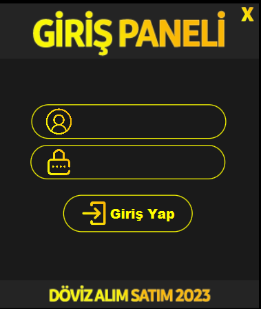
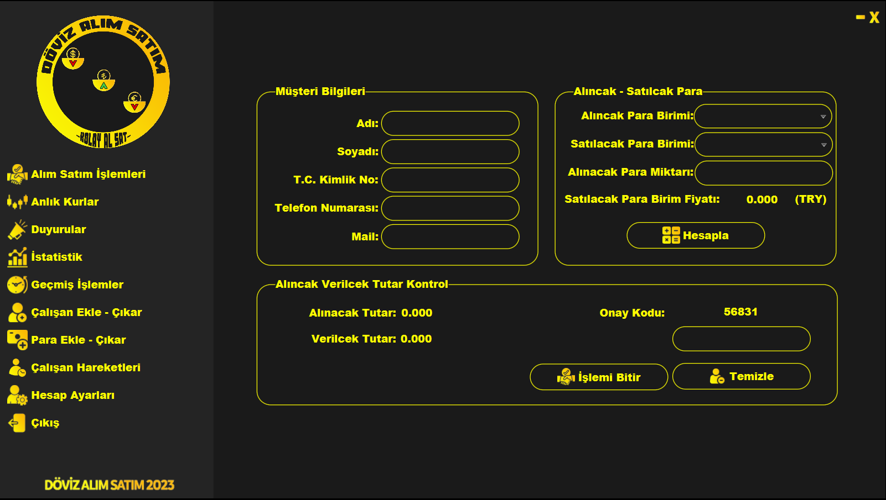
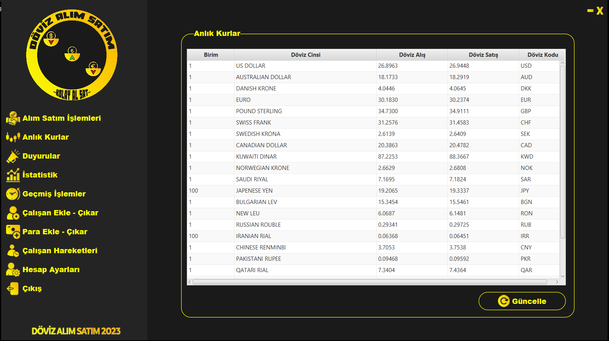
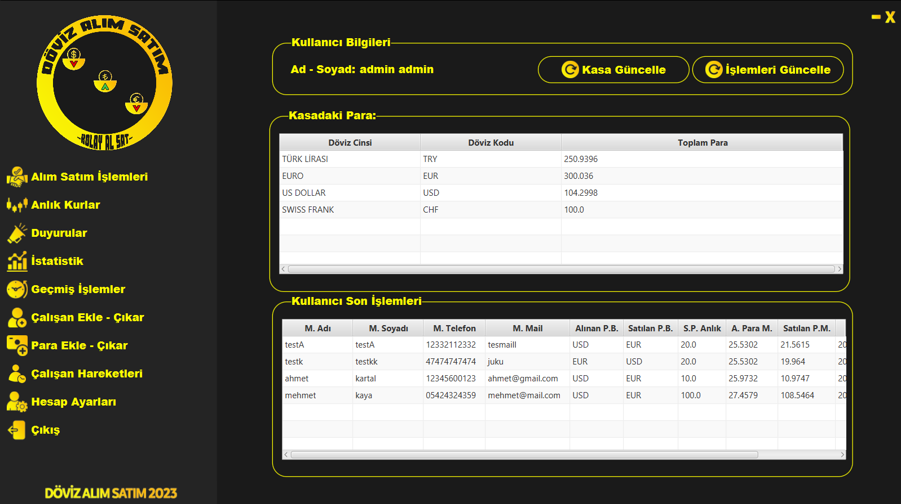
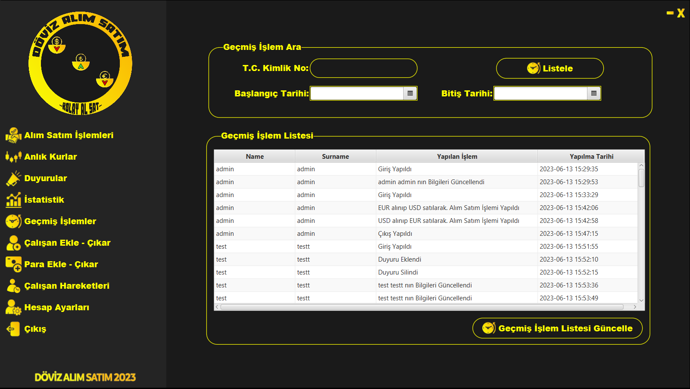

#İNFO

Anlık olarak döviz alım satım işlemleri yapan bir kuruluşta TCMB den anlık olarak veriler çekerek alım satım işlemlerinin yapılmasıın sağlamaktadır aynı zamanda kasa kontrolu yaparak ve log takibi yaparak hataların önlenmesi ve farkedilmesini daha rahat bir şekilde sağlamak için yazılmıştır.

#SCREEN SHOT

NOT: DAHA FAZLA EKRAN GÖRÜNTÜSÜ İÇİN RESİMLERİN ÜSTÜNE TIKLAYINIZ.
 
 

 
 
 

#Contact

 
 
